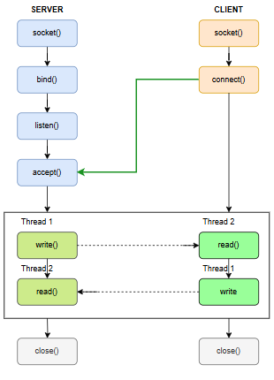
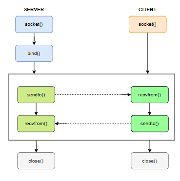
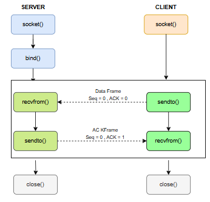
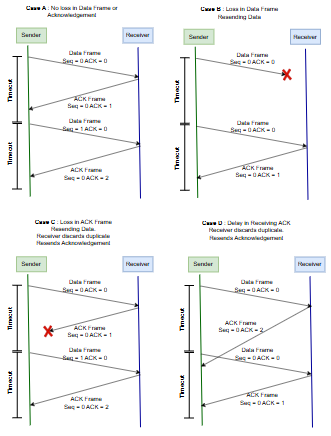
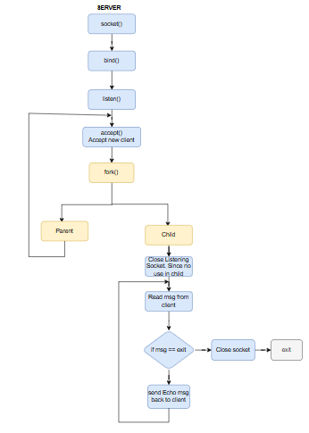
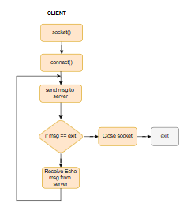
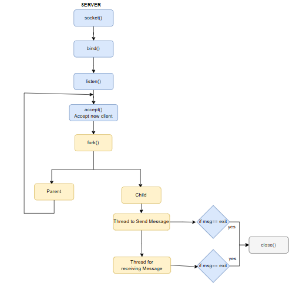
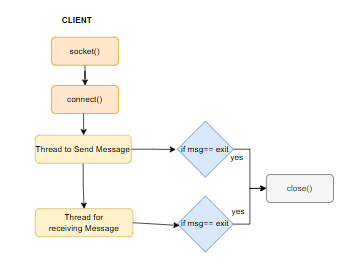
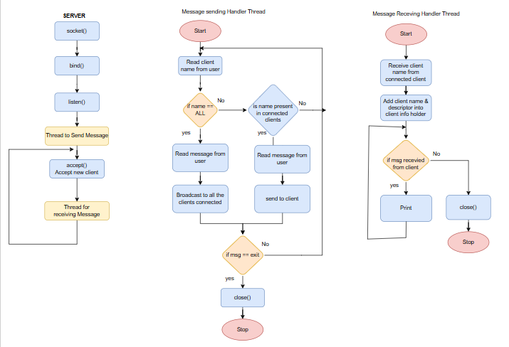
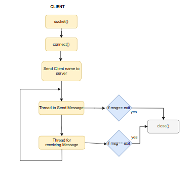

# Socket Programming
Welcome to **Socket Programming** — a personal repository where I document and practice key concepts of Socket programming through hands-on C programs.

---
## 1. Simple TCP Client-Server
This is a simple TCP socket-based client-server application written in C using Linux system calls. It demonstrates basic socket programming with `socket()`, `bind()`, `listen()`, `accept()`, `connect()`, `read()`, and `write()`.

### 📊 Client–Server Communication Diagram

#### 🛠️ Concepts Covered
- `socket()`: Create an endpoint for communication.
- `bind()`: Associate socket with a local IP and port (server-side).
- `connect()`: Establish connection to server (client-side).
- `listen()`: Mark socket as passive to accept connections.
- `accept()`: Accept incoming connection from client.
- `read()` / `write()`: Data transmission APIs.
- `close()`: Graceful shutdown of socket descriptors.

---
## 2. Multithreaded TCP Chat System
Basic chat system between a client and server. The server and client uses two threads one for sending message and another for recieving message to maintain the concurrency.

### 📊 Client–Server Communication Diagram

#### 🛠️ Concepts Covered
- TCP Socket Programming in C : socket(), bind(), listen(), accept(), connect(), read(), write()
- Use of inet_ntop() and inet_pton() for IP conversion
- Network byte order conversion (htons, ntohs)
- POSIX Threads (pthread_create, pthread_join)
- Input/output stream handling with fgets()
- Bidirectional communication using multithreading

---
## 3. Simple UDP Client-Server
A simple message-based communication between a client and a server using **UDP sockets** in C on Linux.
Unlike TCP, UDP is **connectionless**, meaning the client and server don't establish a persistent connection but rather exchange self-contained messages (datagrams).

### 📊 Client–Server Communication Diagram

#### 🛠️ Concepts Covered
- UDP Socket Programming in C
- socket(), bind(), sendto(), recvfrom(), close()
- Use of inet_ntop() and inet_pton() for IP conversion
- Network byte order conversion (htons, ntohs)
- Basic error handling and message 

## 4. Simple UDP Client-Server with Stop and Wait ARQ protocol
This project implements a **Stop-and-Wait ARQ (Automatic Repeat Request)** protocol over **UDP** in C. It includes a client that sends data and a server that acknowledges receipt of each frame. Retransmission is handled if ACK is not received within a timeout.

### 📊 Client–Server Communication Diagram

### 📊 Stop and Wait ARQ Flow Diagram

#### 🛠️ Concepts Covered
- `UDP sockets`
- `Stop-and-Wait ARQ` logic
- Frame structure with sequence number, type, and acknowledgment
- Timeout and retransmission logic in client
- ACK and sequence number handling on server
- Duplicate Frames handling

---
## 5. Multi Client Echo Server using Fork
A simple multi-client TCP chat server using `fork()` in C. Each connected client gets its own process for concurrent communication. Server send echo message back to the client from which it received.

### 📊 Client–Server Communication Diagram

#### 🛠️ Concepts Covered
- Basic TCP server-client communication
- Handles multiple clients using `fork()`
    - Uses fork() to create a child process for each client
    - Parent process continues accepting new connections
    - Child process handles communication with its client
- Echoes back whatever message it receives
- Simple exit handling with "exit" command

#### Limitations
- No threading - each client requires a separate process
- Only echoes messages, no actual chat functionality
- Server cannot initiate communication
- No client identification or targeting

---
## 6. Multi Client Chat server using Fork and Thread
A hybrid multi-client TCP chat server in C combining fork() and pthreads. Each client connection spawns a new process (fork()), with two threads per client for non-blocking I/O:
- Send Thread: Handles outgoing messages to the server.
- Receive Thread: Processes incoming messages from the server.

### 📊 Client–Server Communication Diagram

#### 🛠️ Concepts Covered
-  Improvements over Version **5. Multi Client Echo Server using Fork**
    - Added proper chat functionality (not just echoing)
    - Uses pthreads for concurrent I/O within each client connection
    - Client can send messages to server and receive responses
    - Client naming system introduced
    - Cleaner exit handling
- Still uses fork() to handle multiple clients

#### Limitations
- Server still can't send messages to specific clients
- Uses both fork() and threads which is resource-intensive
- No broadcast or Targeted messaging capability

---
## 7. Multi Client Targeted Chat using only Threads
An advanced multi-client TCP chat server in C using pure pthreads (no fork()). Features a centralized thread-safe client registry, enabling the server to:
- Broadcast or Target specific clients by name (e.g., "Alice: Hello!").
- Dynamically manage connections (add/remove clients).

### 📊 Client–Server Communication Diagram

#### 🛠️ Concepts Covered
- Improvements over **6. Multi Client Chat server using Fork and Thread**
    - Eliminated fork() - uses only pthreads for multi-client handling
    - Server can send messages to specific clients by name
    - More efficient resource usage (no process duplication)
- Client tracking system with mutex protection    - Better client management with add/remove functionality
- Maximum client limit enforcement

---
## 8. Simple File Transfer TCP
This is a simple client-server file transfer application that allows users to:
- Send files from client to server
- Request files from server to client
- Exit the application

#### 🛠️ Concepts Covered
- TCP socket communication
- File metadata transfer (filename, size)
- Basic error handling
- Progress reporting
