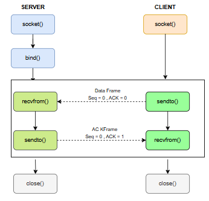

# Socket Programming
Welcome to **Socket Programming** — a personal repository where I document and practice key concepts of Socket programming through hands-on C programs.

---
## Simple TCP Client-Server
This is a simple TCP socket-based client-server application written in C using Linux system calls. It demonstrates basic socket programming with `socket()`, `bind()`, `listen()`, `accept()`, `connect()`, `read()`, and `write()`.

### 📊 Client–Server Communication Diagram

#### 🛠️ Concepts Covered
- `socket()`: Create an endpoint for communication.
- `bind()`: Associate socket with a local IP and port (server-side).
- `connect()`: Establish connection to server (client-side).
- `listen()`: Mark socket as passive to accept connections.
- `accept()`: Accept incoming connection from client.
- `read()` / `write()`: Data transmission APIs.
- `close()`: Graceful shutdown of socket descriptors.

---
## Multithreaded TCP Chat System
Basic chat system between a client and server. The server and client uses two threads one for sending message and another for recieving message to maintain the concurrency.

### 📊 Client–Server Communication Diagram

#### 🛠️ Concepts Covered
- TCP Socket Programming in C : socket(), bind(), listen(), accept(), connect(), read(), write()
- Use of inet_ntop() and inet_pton() for IP conversion
- Network byte order conversion (htons, ntohs)
- POSIX Threads (pthread_create, pthread_join)
- Input/output stream handling with fgets()
- Bidirectional communication using multithreading

---
## Simple UDP Client-Server
A simple message-based communication between a client and a server using **UDP sockets** in C on Linux.
Unlike TCP, UDP is **connectionless**, meaning the client and server don't establish a persistent connection but rather exchange self-contained messages (datagrams).

### 📊 Client–Server Communication Diagram

#### 🛠️ Concepts Covered
- UDP Socket Programming in C
- socket(), bind(), sendto(), recvfrom(), close()
- Use of inet_ntop() and inet_pton() for IP conversion
- Network byte order conversion (htons, ntohs)
- Basic error handling and message 

## Simple UDP Client-Server with Stop and Wait ARQ protocol
This project implements a **Stop-and-Wait ARQ (Automatic Repeat Request)** protocol over **UDP** in C. It includes a client that sends data and a server that acknowledges receipt of each frame. Retransmission is handled if ACK is not received within a timeout.

### 📊 Client–Server Communication Diagram

#### 🛠️ Concepts Covered
- `UDP sockets`
- `Stop-and-Wait ARQ` logic
- Frame structure with sequence number, type, and acknowledgment
- Timeout and retransmission logic in client
- ACK and sequence number handling on server
- Duplicate Frames handling
